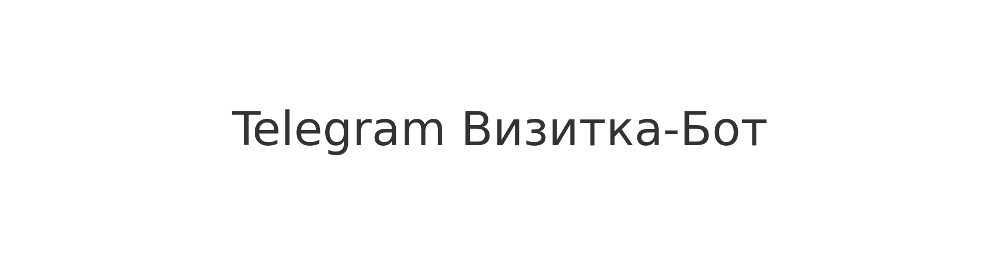

<!-- PROJECT BANNER -->
<p align="center">
  
</p>

<h1 align="center">📱 Telegram Визитка-Бот</h1>
<p align="center">
  Современный многофункциональный Telegram-бот-визитка (RU/EN) c мини-CRM, SQLite, админ-панелью и гибкой конфигурацией.
</p>
<p align="center">
  <a href="#"></a>
  <a href="#"></a>
  <a href="#"></a>
  <a href="#"></a>
</p>

---

## ✨ Возможности

### 🔸 **Публичная часть**
- Красивое меню-визитка
- Два языка интерфейса: 🇷🇺 RU / 🇬🇧 EN
- Разделы:
  - ℹ Обо мне
  - 💼 Услуги
  - 📞 Контакты
  - 📱 Соцсети
  - 🌐 Сайт
  - ✉ Обратная связь
- Сохранение языка каждого пользователя в БД
- Отправка заявок админу

---

### 🔸 **Админ-панель**
Команда: `/admin`
Доступна только `ADMIN_ID` из `.env`

Функционал:
- Выбор языка редактируемого контента
- Редактирование всех разделов (Обо мне / Услуги / Контакты / Соцсети / Сайт)
- Мгновенное сохранение текстов в SQLite

---

### 🔸 **Технологии**
- **Python 3.10+**
- **Aiogram 3.7+**
- **SQLite**
- **FSM (состояния)**
- **.env конфигурация**
- **Docker & Docker Compose**

---

## 🏗 Структура проекта

```text
tg_vizit/
│── bot.py
│── config.py
│── requirements.txt
│── README.md
│── .env
│── .gitignore
│── Dockerfile
│── docker-compose.yml
│
└── app/
    ├── states.py
    ├── database/
    ├── localization/
    ├── services/
    ├── keyboards/
    └── handlers/
```
⚙️ Установка и запуск
1️⃣ Клонировать репозиторий
```
git clone https://github.com/Anllane/tg_vizit.git
cd tg_vizit
```

2️⃣ Установить зависимости
```
pip install -r requirements.txt
```

3️⃣ Создать .env
```
BOT_TOKEN=ваш_токен
ADMIN_ID=123456789
DATABASE_PATH=bot.db
```

4️⃣ Запуск
python bot.py

🐳 Запуск через Docker
Сборка:
```
docker build -t tg_vizit .
```

Запуск:
```
docker run -d --env-file .env tg_vizit
```

Docker Compose:
```
docker-compose up -d
```

📬 Обратная связь

Пользователь может отправить сообщение →
бот сохранит его в БД →
отправит админу в Telegram.

📄 Лицензия

Проект распространяется под лицензией MIT.
Вы можете свободно использовать, модифицировать и распространять проект.

👨‍💻 Автор проекта

Anllane
Телеграм: @Mzerat1
GitHub: https://github.com/Anllane

<p align="center"> ⭐️ Если проект понравился — поставьте звезду в GitHub! </p>   
